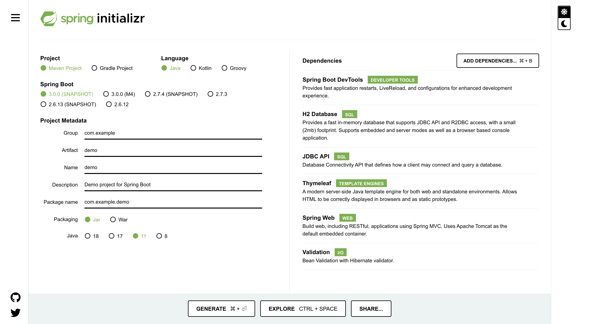
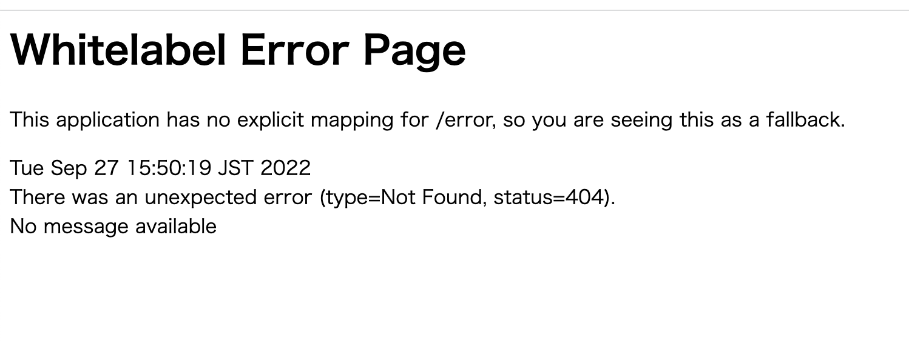

### 教材
- [Spring 入門 ～ SpringBoot 2 を使ってお問い合わせアプリとToDoアプリを作る ～](https://www.udemy.com/share/101w4u3@ot0IbBuDprGAbaljMb8Rs0Nw15x6B1Z6JI9Tp2QNlRMUvLYOpXs8Mt2QZmy4mRSJ/)を勉強したまとめ

# 環境構築

1. https://start.spring.io/ を開き、spring bootの初期設定を行う

例: 以下画像の設定は[こちら](https://start.spring.io/#!type=maven-project&language=java&platformVersion=3.0.0-SNAPSHOT&packaging=jar&jvmVersion=11&groupId=com.example&artifactId=demo&name=demo&description=Demo%20project%20for%20Spring%20Boot&packageName=com.example.demo&dependencies=devtools,h2,jdbc,thymeleaf,web,validation)をご参考ください。

2. `generate` ボタンから作成する
3. zipファイルが生成されるので、それを解凍すると初期環境構築が完了
4. 作成したディレクトリの中で`$ mvn spring-boot:run` を実行するとサーバを起動できる
    - (4)までの実行では`Whitelabel Error Page`と表示される

### errors
- `The import java.util cannot be resolvedJava`が出た時
  - https://scrapbox.io/cybernote/VSCODE%E3%82%A8%E3%83%A9%E3%83%BC%E3%83%A1%E3%83%83%E3%82%BB%E3%83%BC%E3%82%B8
